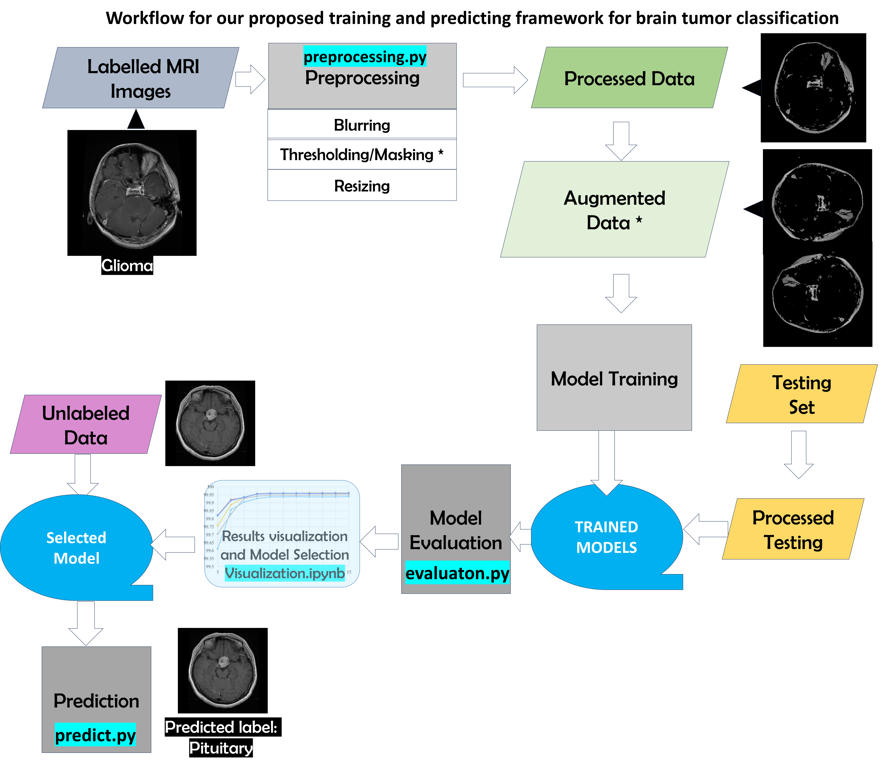

# Brain Tumor Classification

According to American Association of Neurological Surgeons, brain tumor is an abnormal mass of tissue in which ceels grow and multiply uncontrollably, seemlingly unchecked by the mechanisms that control normal cells. A major challenge for brain tumor detection arises from the variations in tumor location, size, shape, and the imaging quality of MRI. 
In this project, we aim to distinguish 3 different brain tumor types: glioma(malignant), pituitary and meningioma (both benign), and no tumor.  

## Table Of Content

- [Dataset](#dataset)

- [workflow](#workflow)
- [Preprocessing](#preprocessing)
  - [Masking](#masking)
- [Model](#model)
  - [CNN models](#cnn-models)
  - [Fine-tuning models](#fine-tuning-models)
- [Training](#training)
- [Evaluation](#evaluation)
- [Prediction](#prediction)
- [Other Files and Folders](#other-files)
- [Future works](#future-works)
- [References](#references)


## Dataset

The Brain Tumor MRI Dataset is a collection of 7,023 human brain MRI images, which are categorized into Glioma, Meningioma, No tumor, and Pituitary. This dataset is available on Kaggle and has been provided by MASOUD NICKPARVAR. [View the dataset here](https://www.kaggle.com/datasets/masoudnickparvar/brain-tumor-mri-dataset)


## Workflow




## Preprocessing

Install the required packages for python in your current environment or create a new environment for this program.

    
    pip install -r requirements.txt

Run the following script

    
    python preprocessing.py --masking 1
    

This command will take the images under data/Training and data/Testing as original data and apply some blurring, masking, cropping and resizing to the images and store the resulting images in folders look like Processed_* or Unmasked_Processed_* depending if masking is used. If folders already exist, the program would clear contents in the folders and store newly processed images in those folders.

`--masking` would specify is masking is used. If set to True, a kapur thresholding method will be applied on the images and mask the umimport parts.

### Masking


The following is the data augmentation effect:


## Model

In the model.py file, a total of four models have been constructed: two distinct CNN models and two fine-tuning models that utilize different pre-trained deep learning models as feature extractor.

### CNN models

The model structures of CNN1 and CNN2 are entirely different. CNN1 comprises five convolutional layers, with a max pooling 2D layer after the second and last convolutional layers respectively. The dropout layer for regularization after the third fully connected layer. CNN2 features three consecutive **conv-pooling-batch normalization blocks**. In CNN2, the convolutional layers employ larger kernels for swift dimension reduction. There are three fully connected layers, with a dropout layer each after the first two fully connected layers for regularization. These two models possess 3,730,932 and 3,943,108 parameters respectively.

The structure of the CNN1 model:


The structure of the CNN2 model:


### Fine-tuning models

The two fine-tuning models utilize **VGG19** and **InceptionV3** as feature extractors, respectively, followed by the construction of a 5-layer CNN classifier. Both VGG19 and InceptionV3 utilize weights pre-trained on ImageNet.

The structure of the fine-tuning model (with inceptionv3):


## Training

    
    python train.py --model CNN2 --bs 64 --epoch 20 --aug True --c False --lr 0.00001
    
    
This piece of code would train a model of type "CNN2" (`--model` argument), with learning rate (lr) of 0.00001. `--bs`, `--epoch` with specify the batch size and epoch number for training.

`--aug `indicates if data augmentation is used. The data augmentation operations set in this project include: random image rotation, random scaling, random cropping, random flipping, and adjusting image brightness.

`--c` will instruct the program if the model would continue training from a previously trained model by loading weights from that model(the program will look for the model with the best performance from the folder).

After training, the weights of the model will be stored in the corresponding subfolder under models folder, and a history.json file will also be generated to record the model performance and loss throughout the training process.


### Evaluation

To evaluate a specific saved model(weights), simply use:

    
     python evaluate.py --path models/masked_CNN2_aug/weights-11-0.79.h5
    

where `--path` specify the path of the saved weights to be evaluated. This code will evaluate this model on the test dataset, print out the accuracy, precision and recall and plot confusion matrices. The code block above evaluate a CNN2 model trained on augmented and masked dataset.

The output result is as follows:

```text
The model to be evaluated is: models/masked_inceptionv3_aug/weights-12-0.76.h5
the test data used are stored in path: D:\project_copy\project\data\Processed_Testing
Found 1311 images belonging to 4 classes.
Model successfully built...
Weights have been loaded, now predicting...
20/20 [==============================] - 41s 2s/step
Precision: 0.7061810543953402 

Recall: 0.6612236746550472 


Accuracy is 0.684973
```

<div style="display: flex; justify-content: space-between;">
    
    
    
</div>


### Prediction

To classify new images in a specific folder (default folder is data/Predict, can be set in config.yml), use the code

    
     python predict.py --path models/masked_CNN2_aug/weights-11-0.79.h5
    

where `--path` argument specify the model being used for prediction. Prediction results will be printed and all images will be stored under new names where their predicted tumor type will be included in their new file names.

The output result is as follows:

```text
Model successfully built...
Weights have been loaded, now predicting...
1/1 [==============================] - 0s 20ms/step
@@@@@@@Image: Te-no_0014.jpg, Predicted Class:notumor with probability 0.9964568

1/1 [==============================] - 0s 19ms/step
@@@@@@@Image: Te-no_0014_notumor.jpg, Predicted Class:notumor with probability 0.9964568

1/1 [==============================] - 0s 20ms/step
@@@@@@@Image: Te-gl_0013_meningioma.jpg, Predicted Class:glioma with probability 0.993975
```

### Other files

`model.py` building different CNN and transfer learning architectures

`config.yml `some configurations for preprocessing, training, testing and predicting

`Visualization.ipynb`: jupyter notebook file for visualizing the model architectures, result evaluation and model comparison.

`data_loader.py` Generating data loader for training, validation and testing

`utils.py` Some utility functions being used during the course of the project

`visualize.py` some functions for visualization

`kapur.py` kapur thresholding

`models ` parent folder stores saved weights .h5 files trained from different model architectures under different preprocessing speficications. Also a history.json

file would store the model training and validation performance history.

`report` folder stores some metrics and visualization results for model comparison and evaluation.


## Future Works

- Data segmentation should be used(when labelled data are available)

- Fix image quality issues
  -Differ by Tumor Type, introducing systematic bias
  -By compressing the MRI images from different size to 256*256, some finer details are lost, therefore losing some capacity 

- Some optimization techniques can be used. 
  -Deep Feature Extraction: More data and computational resources are required.
  -Parameter Optimization: Higher cost of implementation.


## References

[Classification Framework for Medical Diagnosis of Brain Tumor with an Effective Hybrid Transfer Learning Model](https://www.ncbi.nlm.nih.gov/pmc/articles/PMC9600529/)

[Human brain tumor classification and segmentation using CNN](https://dl.acm.org/doi/abs/10.1007/s11042-022-13713-2)

